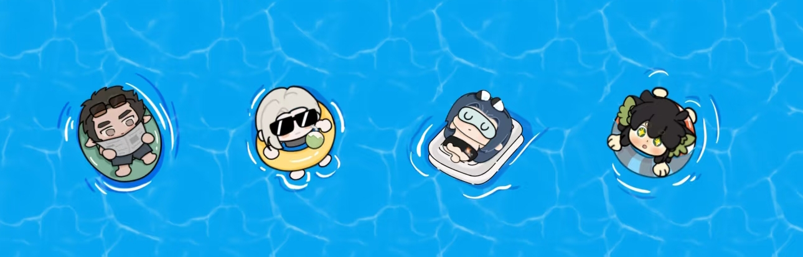

  

<h3 align="center">
    
</h3>

  
  
  
  

---

### 👨‍💻 关于我 (About Me)

- 🔭 我目前正在开发 **City-Outskirts-Tour-Agent
，一个简单的React agent demo**、PaddleOCR预处理小工具、智能面试 Agent-ProView
- 🌱 我正在学习 **RAG、LLM、RL、langchain**
- 👯 我希望能在这个方向上进行协作： **强化学习，agent应用**
- 📫 如何联系我： **hdl0105@foxmail.com**

---

### 🛠️ 技术栈 (Tech Stack)

	
	
	
	
    

---
### 📊 GitHub 数据统计 (Stats)

