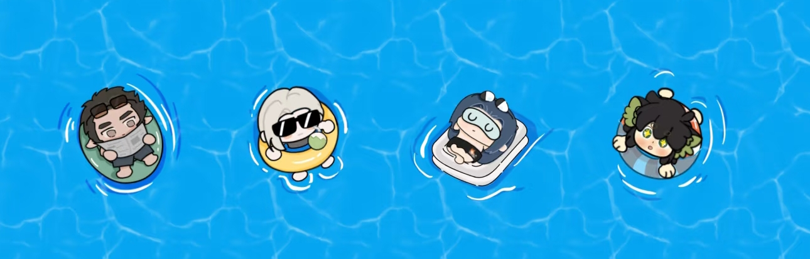

  

<h3 align="center">
    
</h3>

  
  
  
  

---

### 👨‍💻 关于我 (About Me)

- 🔭 我目前正在开发 **City-Outskirts-Tour-Agent**、**PaddleOCR 预处理小工具**、**智能面试 Agent - ProView** 和 **Chat-Agent 高情商聊天回复助手**
- 💬 **Chat-Agent** 是一个本地桌面端 AI 回复辅助项目，尝试将截图识别、上下文理解和自然语言生成串联成轻量可用的回复工作流
- 🤖 **ProView** 是一个面向智能面试场景的 AI Agent 项目，关注简历解析、面试问答、候选人能力评估与桌面端体验优化
- 🌱 我正在学习和探索 **RAG、LLM、强化学习、LangChain、Agent 应用开发、多模态 OCR 与桌面端 AI 工具**
- 👯 我希望能在 **强化学习、AI Agent、LLM 应用、AI 产品落地** 等方向上进行协作
- 💡 我对将 AI 能力落地到真实应用场景很感兴趣，也喜欢构建有完整交互体验、能真正解决问题的产品
- 🧩 我关注从 **需求分析、后端服务、前端交互、桌面端体验到模型能力接入** 的完整开发链路
- 📫 如何联系我： **hdl0105@foxmail.com**

---

### 🛠️ 技术栈 (Tech Stack)

  
  
  
  
  
  
  
  
  
  
  
  

---

